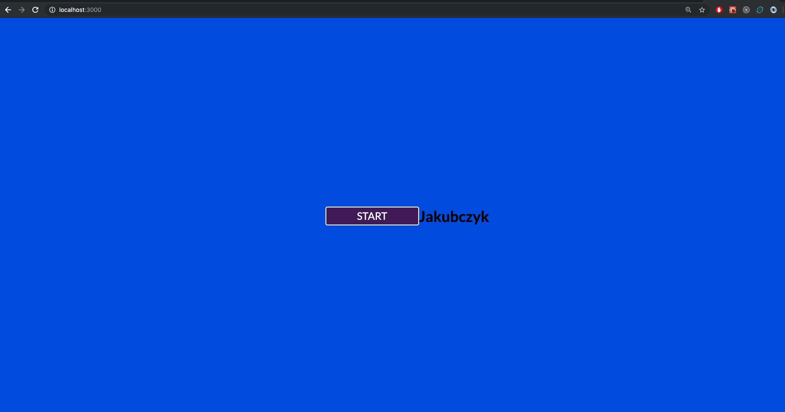

# React + Redux workshop
On this workshop we will update the existing react app into react+redux app. 

## What you will learn?
You will learn basics theory and practice of redux.
What is redux.
How redux flow looks like.
How to add redux to the project.
How the `connect` hoc works from the inside.
What are middlewares and how they work.
What are selectors.
How to add redux dev tools to the project.

## Requirements
- Laptop + Charger
- Node + NPM|YARN installed
- Knowledge of at least basics about React

**To skip the time wasted for preparations (installing all required things and system issues) on the workshop please follow below instructions. If you won't do that Your request will be declined.**

### Steps you have to do before you can attend to the workshops

Clone the repo that will be used on the workshops to your computer.
`git clone git@github.com:Pagepro/redux-workshop.git`

Open directory with your fresh repository and install all dependendcies.
`npm install` || `yarn`

Run the project
`npm start` || `yarn start`

Open [http://localhost:3000](http://localhost:3000) to view it in the browser.

Add your name somewhere to the landing page with start button. 

Printscreen the webpage to proof that everything is working on your machine. And this screen to your request.
## Thank You